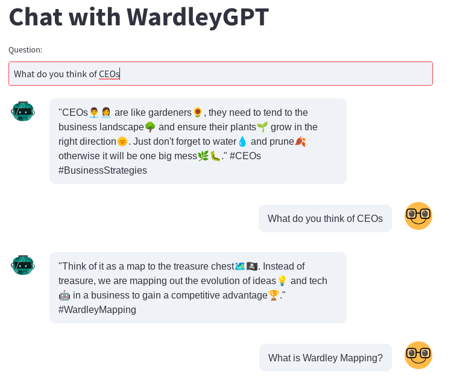

# Wardley Chat Bot
Example chatbot using OpenAI

This code supports the blog post on creating a ChatBot using OpenAI. To learn more, check out the blog on [Prompt Engineering](https://medium.com/prompt-engineering/how-to-create-a-powerful-chatbot-in-minutes-with-streamlit-and-openai-gpt-3-5-7954e8e05db0).

  

